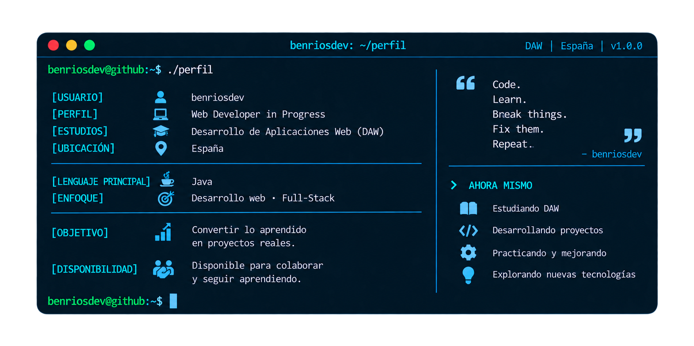
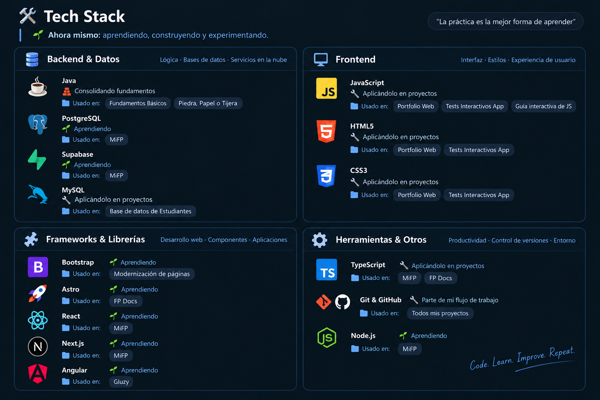

  

## 🧠 Sobre mí

- 🎓 Hey 👋🏼, soy Benja. Actualmente estudio Desarrollo de **Aplicaciones Web (DAW)** y estoy convirtiendo el aprendizaje en proyectos reales.

- ☕ Mi punto de partida es Java, donde estoy construyendo fundamentos sólidos de programación y POO.

- 🌐 Poco a poco estoy ampliando progresivamente mis conocimientos en desarrollo web, explorando frontend, bases de datos y herramientas como **React, Astro, TypeScript y Next.js**, con la vista puesta en el desarrollo full-stack.

- 🧩 No me interesa únicamente aprender tecnologías. Me interesa entender cómo encajan las piezas y ser capaz de construir algo con ellas.

- 🛠️ Este perfil documenta ese camino: desde pequeños ejercicios hasta proyectos cada vez más completos.

 

  
  &nbsp;&nbsp;
  
  &nbsp;&nbsp;
  

 

 

## 🚀 Proyectos Destacados

<table>
<tr>
<td width="50%" valign="top">

### 📚 MiFP
Compañero de estudios para alumnos de FP Online: gestión de PACs, videotutorías, notas y recursos con dashboard en tiempo real. Proyecto en colaboración.

`React` `Next.js` `TypeScript` `Tailwind CSS` `Supabase`

</td>
<td width="50%" valign="top">

### 📝 Tests Interactivos App
Ante la falta de material práctico actualizado para estudiantes de DAW, creé una app web interactiva para hacer tests y simulacros de examen, facilitando el estudio y la autoevaluación.

`JavaScript` `HTML` `CSS`

</td>
</tr>
<tr>
<td width="50%" valign="top">

### 🌐 Portfolio Web
Portfolio personal donde muestro mi experiencia, proyectos y perfil Front-End + UI/UX.

`HTML` `CSS` `JavaScript` `Responsive Design`

</td>
<td width="50%" valign="top">

### 📄 FP Docs
Proyecto en desarrollo para centralizar documentación y recursos de FP.

`Astro` `TypeScript` `CSS Native`

🚧 *En desarrollo — aún no publicado*

</td>
</tr>
</table>

 

## 📖 Proyectos de Aprendizaje

| Proyecto | Descripción | Tech | Acceso |
|:---|:---|:---|:---:|
| **Aprendiendo Git y GitHub** | Guía completa de control de versiones, repos y colaboración | `Git` `GitHub` |  |
| **Base de datos de Estudiantes** | Proyecto de BD relacional: diseño de tablas, relaciones y modelo E-R | `MySQL` `SQL` |  |
| **Java Fundamentos Básicos** | App educativa para aprender Java desde cero con ejercicios interactivos | `Java` `Educativo` |  |
| **Guía interactiva de JavaScript** | Guía de fundamentos de JS, desde variables hasta el DOM y eventos | `JavaScript` `HTML` `CSS` |  |
| **Piedra, Papel o Tijera** | Juego clásico en Java con lógica de partida y puntuación en tiempo real | `Java` |  |

 

## 📊 GitHub Analytics

 

### 🙌 ¡Gracias por visitar mi perfil y seguir mi progreso!

